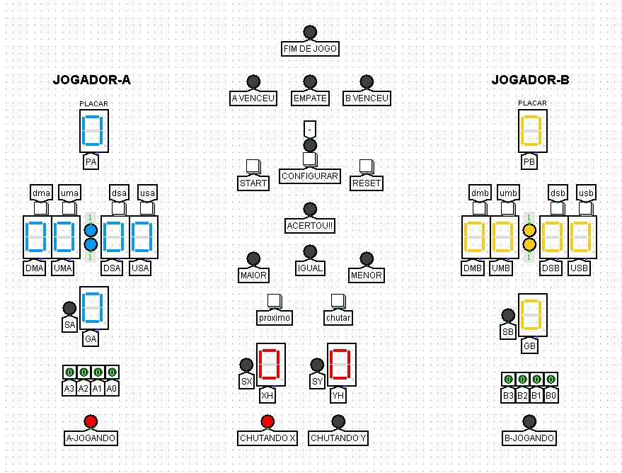
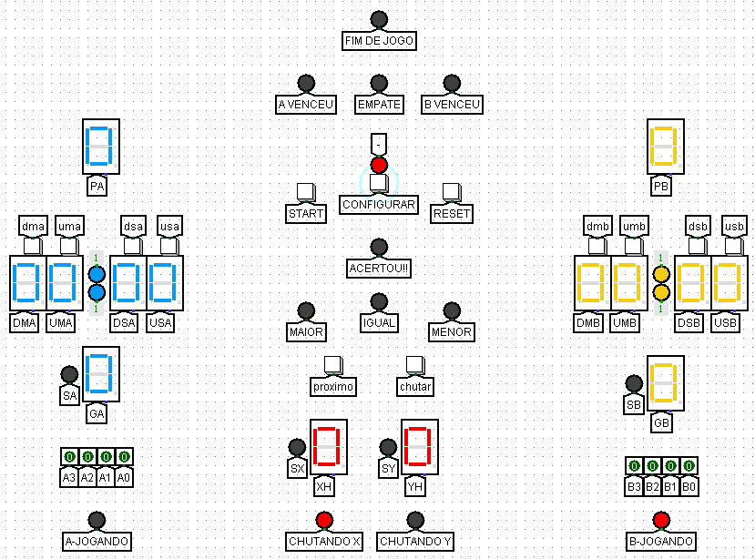

# Guess-The-Number-Xtreme

## Sobre o Jogo 

O **Guess The Number Xtreme** é uma competição entre dois jogadores baseado em Circuitos Digitais, no qual o objetivo é adivinhar um ponto no espaço definido por coordenadas x e y. Cada coordenada é um número de 4 bits escolhido aleatoriamente. Os jogadores fazem palpites, indicando combinações de coordenadas, e o jogo fornece dicas com base nesses palpites com base na soma das coordenadas no espaço, para vencer o tempo dos dois jogadores tem que zerar, e o jogador com a maior pontuação vence, ou aquele que chegar a 15 pontos primeiro vencerá.

## Como Funciona

- [x] **Alternar Jogadores:** O jogo começa com um jogador fazendo um palpite de coordenadas, tentando adivinhar as coordenadas do ponto oculto. Enquanto um jogador faz um palpite, o outro aguarda sua vez.

- [x] **Avaliação dos Palpites:** O jogo avalia a precisão do palpite comparando a soma das coordenadas do palpite com a soma das coordenadas reais do ponto oculto. Os valores de X e Y podem ser visualizados pelos jogadores durante o jogo para ajudar nas adivinhações.

- [x] **Pontuação dos Jogadores:** Os jogadores ganha 1 ponto ao acertar as coordenadas do ponto oculto. Cada palpite preciso resulta em 1 ponto adicionado ao placar do jogador correspondente.

- [x] **Tempo Limite:** Cada jogador tem um cronômetro associado, que começa a diminuir assim que é a sua vez de fazer um palpite. O jogo continua até que o tempo de ambos os jogadores se esgote.

- [x] **Configuração de Tempo:** Os jogadores têm a opção de ajustar o tempo de jogo usando o botão de configuração, permitindo personalizar a duração da partida de acordo com suas preferências.

- [x] **Determinação do Vencedor:** O vencedor do jogo é aquele que acumula mais pontos no final da partida quando o tempo se esgotar. Alternativamente, se um jogador atingir 15 pontos primeiro, ele também é declarado vencedor automaticamente.

## Como Jogar

1. Configurando o Tempo:

    - Antes de iniciar o jogo, é necessário configurar o tempo limite para cada jogador. Isso pode ser feito no início do jogo, garantindo que ambos os jogadores tenham a mesma quantidade de tempo para suas jogadas.
      
2. Iniciando o Jogo:

    - Ao clicar em "Start", o jogo começa com o jogador A.
      
3. Fazendo um Palpite:

    - O jogador A precisa dar um palpite para as coordenadas X e Y.
    - Clique em "Chutar" para confirmar sua escolha para cada coordenada.
    - Os valores de X e Y são mostrados em um display hexadecimal.
      
4. Próxima Jogada:

    - Após fazer o palpite de X, clique no botão "Próximo" para definir sua jogada de Y.
    - Clique em "Próximo" novamente para comparar o valor (menor, maior ou igual).
    - Clique em "Próximo" novamente para passar sua vez.
      
5. Comparando Palpites:

    - As coordenadas digitadas são comparadas com as coordenadas do número oculto.
    - Três LEDs indicam se o palpite foi menor, maior ou igual às coordenadas ocultas.
      
6. Pontuação e Troca de Número Oculto:

    - Se o jogador A acertar as duas coordenadas, seu placar é aumentado em 1 ponto, e um novo número oculto é gerado automaticamente.
    - Se o palpite for maior ou menor, a vez passa para o próximo jogador.
      
7. Continuando o Jogo:

    - Repita os passos 2 a 6 até que um jogador acerte as coordenadas ocultas.
  
8. Determinando o Vencedor:

    - Quando os cronômetros de ambos os jogadores se esgotarem, o jogador com a maior pontuação é declarado vencedor.
    - Alternativamente, se um jogador atingir 15 pontos primeiro, ele vence automaticamente.
